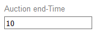
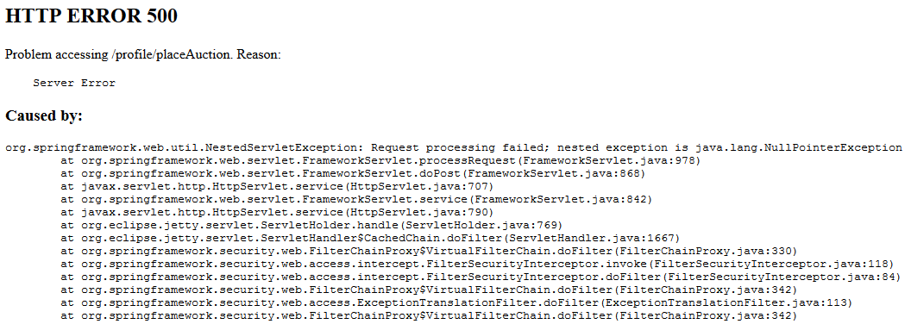
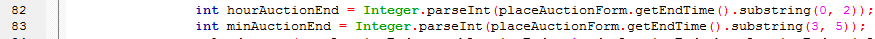

# Issue 5

If you don't enter the end time in the correct format (you don't know what the correct format is), you get a failure with a null pointer exception

Failure is due to substring which doesn't exists if end time is not 5 characters long

